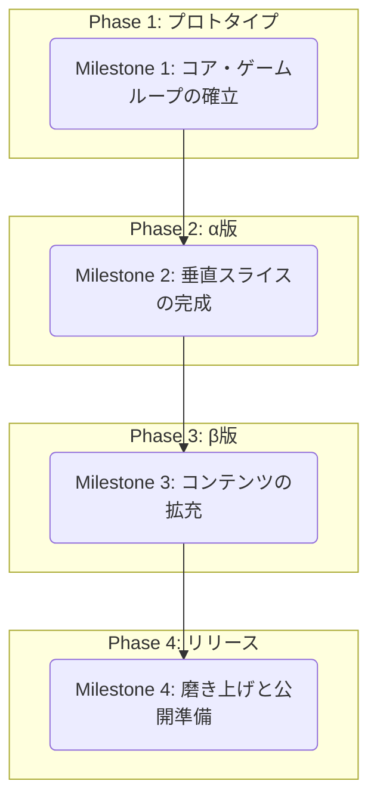

### ゲーム開発マイルストーン案

このマイルストーンは、まず「ゲームの楽しさの核」を最速で検証し、その後、肉付けしていくことで、手戻りを少なくしつつ着実に開発を進めることを目的とします。

---

### Milestone 1: コア・ゲームループの確立 (～1週間)
**目標:** 「戦闘 → 強化 → さらなる戦闘」という、ゲームの最も基本的なサイクルを体験できる、最小限の動くプロトタイプを作成する。

-   **技術基盤**
    -   [x] Next.js, TypeScript, Tailwind CSS, Mantineのプロジェクトセットアップ
    -   [x] ゲーム画面の基本的な描画キャンバスを用意
-   **プレイヤー**
    -   [x] マウスカーソルに追従して移動する機能
    -   [x] HPとマナのステータスを持つ
-   **戦闘**
    -   [x] 1種類の基本魔法（例: `魔力の拳`）を自動で発射する
    -   [x] 1種類の敵（例: `兵士`）が画面外から出現する
    -   [x] 敵を倒すと経験値アイテム（魂のかけら）をドロップする
    -   [x] プレイヤーが経験値アイテムを回収できる
-   **成長システム**
    -   [x] 経験値ゲージが満タンになるとレベルアップし、戦闘が一時停止する
    -   [x] レベルアップ時に、3つのダミー選択肢（例: 「威力UP」「範囲UP」「新魔法」）が表示され、1つを選択できる
    -   [x] 選択に応じて、プレイヤーの性能が実際に強化される
-   **ゲームサイクル**
    -   [ ] プレイヤーのHPが0になると、コンソールに「ゲームオーバー」と表示され、ゲームが停止する

---

### Milestone 2: 垂直スライスの完成 (～2週間)
**目標:** ゲームの開始から終了まで、一通りの流れを体験できる状態（α版）にする。UIや基本的なゲームシステムを実装する。

-   **UI/UX (`pagetransition.md`)**
    -   [ ] **タイトル画面:** 「出撃」ボタンでゲームを開始できる
    -   [ ] **ゲーム画面HUD:** 生存時間、レベル、経験値、HP/マナバーを正式なUIとして表示
    -   [ ] **レベルアップ画面:** 3枚のカードから1枚を選択するUIを実装
    -   [ ] **リザルト画面:** ゲームオーバー後、生存時間とスコアを表示
-   **ゲームシステム (`specification.md`)**
    -   [ ] **魔法システム:**
        -   [ ] 魔法に「属性」の概念を導入
        -   [ ] 複数の基本魔法（打撃・炎・氷・雷を各1種以上）を実装 (`spell.md`)
    -   [ ] **敵システム:**
        -   [ ] 役割の異なる敵（`狙撃手`など）を1-2種類追加
        -   [ ] 特定の生存時間でボス（`勇者`）が出現する
-   **画面遷移 (`pagetransition.md`)**
    -   [ ] タイトル → ゲームプレイ → ゲームオーバー → リザルト → タイトル、という基本的な画面遷移を実装

---

### Milestone 3: コンテンツの拡充 (～3週間)
**目標:** ゲームの戦略性とリプレイ性を高めるため、魔法、敵、その他のコンテンツを大幅に追加する（β版）。

-   **魔法システム (`spell.md`)**
    -   [ ] 基本魔法の種類を大幅に追加（各属性3～4種程度）
    -   [ ] **「魔法調整盤」**システムを実装し、リストから数種類を先行実装
    -   [ ] **「合成魔法」**システムを実装し、1-2種類の合成魔法を実装
-   **コンテンツ (`specification.md`)**
    -   [ ] 敵キャラクターの種類を大幅に追加
    -   [ ] 敵の出現パターンを複数用意し、ウェーブごとに変化させる
    -   [ ] プレイアブルキャラクターの概念を導入（初期キャラクター1名）
-   **演出 (`specification.md`)**
    -   [ ] 背景の終末演出（ターン経過で空の色が変わるなど）
    -   [ ] カードデザインを属性や効果が分かりやすいように装飾
    -   [ ] 主要な効果音（魔法の発射音、被弾音、レベルアップ音など）を実装

---

### Milestone 4: 磨き上げと公開準備 (～2週間)
**目標:** 製品としての完成度を高め、いつでも公開できる状態にする。

-   **メタシステム (`specification.md`)**
    -   [ ] **メタプログレッション:**
        -   [ ] リザルト画面でスコアに応じたリソース（`絶望の残滓`）を獲得
        -   [ ] 獲得したリソースで、永続的な強化（初期HPアップなど）を行える画面を実装
    -   [ ] **実績システム（魔導書）:**
        -   [ ] 使用した魔法や調整盤が記録されるコレクション画面を実装
        -   [ ] 達成率に応じたボーナスを付与する
-   **UI/UX (`pagetransition.md`)**
    -   [ ] キャラクター選択画面（部隊編成）を実装
    -   [ ] ポーズ画面、設定画面を実装
    -   [ ] 全体的なUIのブラッシュアップと、スムーズな画面遷移の最適化
-   **最終調整**
    -   [ ] ゲームバランスの総合的な調整（魔法、敵、成長速度など）
    -   [ ] パフォーマンスの最適化
    -   [ ] 発見されたバグの修正
