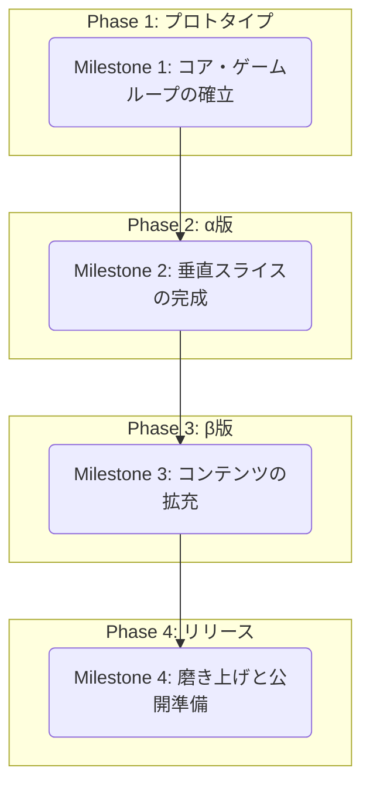

### ゲーム開発マイルストーン案

このマイルストーンは、まず「ゲームの楽しさの核」を最速で検証し、その後、肉付けしていくことで、手戻りを少なくしつつ着実に開発を進めることを目的とします。

---

### Milestone 1: コア・ゲームループの確立 (～1週間)
**目標:** 「戦闘 → 強化 → さらなる戦闘」という、ゲームの最も基本的なサイクルを体験できる、最小限の動くプロトタイプを作成する。

-   **技術基盤**
    -   [x] Next.js, TypeScript, Tailwind CSS, Mantineのプロジェクトセットアップ
    -   [x] ゲーム画面の基本的な描画キャンバスを用意
-   **プレイヤー**
    -   [x] マウスカーソルに追従して移動する機能
    -   [x] HPとマナのステータスを持つ
-   **戦闘**
    -   [x] 1種類の基本魔法（例: `魔力の拳`）を自動で発射する
    -   [x] 1種類の敵（例: `兵士`）が画面外から出現する
    -   [x] 敵を倒すと経験値アイテム（魂のかけら）をドロップする
    -   [x] プレイヤーが経験値アイテムを回収できる
-   **成長システム**
    -   [x] 経験値ゲージが満タンになるとレベルアップし、戦闘が一時停止する
    -   [x] レベルアップ時に、未習得の魔法と既存魔法の強化が選択肢として提示されるように変更
    -   [x] 選択に応じて、プレイヤーの性能が実際に強化される (ダミー実装)
-   **ゲームサイクル**
    -   [x] プレイヤーのHPが0になると、コンソールに「ゲームオーバー」と表示され、ゲームが停止する

---

### Milestone 2: 垂直スライスの完成 (～2週間)
**目標:** ゲームの開始から終了まで、一通りの流れを体験できる状態（α版）にする。UIや基本的なゲームシステムを実装する。

-   **UI/UX (`pagetransition.md`)**
    -   [x] **タイトル画面:** 「出撃」ボタンでゲームを開始できる
    -   [x] **ゲーム画面HUD:** 生存時間、レベル、経験値、HP/マナバーを正式なUIとして表示
    -   [x] **レベルアップ画面:** 3枚のカードから1枚を選択するUIを実装
    -   [x] **リザルト画面:** ゲームオーバー後、生存時間とスコアを表示
-   **ゲームシステム (`specification.md`)**
    -   [x] **魔法システム:**
        -   [x] 魔法に「属性」の概念を導入
        -   [x] 複数の基本魔法（打撃・炎・氷・雷を各1種以上）を実装 (`spell.md`)
        -   [x] **レベルアップ時に、未習得の魔法と既存魔法の強化が選択肢として提示されるように変更**
        -   [x] **各魔法が、固有のクールダウンとマナ消費に基づいて、独立して自動発動するように修正**
        -   [x] **チェインライトニングの連鎖攻撃にアニメーションを追加**
        -   [x] **魔法に寿命、弾速、着弾範囲、自傷有無の概念を追加**
            -   `kigame/src/data/spells.ts`に`GroundEffect`インターフェースと`Spell`インターフェースの`groundEffect`プロパティを追加し、`fireball`のデータに地面効果の定義を追加。
            -   `fireball`の`groundEffect.duration`を10秒に延長。
        -   [x] **魔法の視覚表現を「飛翔体」と「着弾エフェクト」に分離**
            -   `kigame/src/components/GroundFlameEffect.tsx`を作成し、地面効果の視覚的な表示を担当。
            -   `kigame/src/styles/spells.css`に`ground-flame-effect`のCSSアニメーションを追加。
        -   [x] **魔法に自傷ダメージと行動不能効果を実装し、それに伴うゲームロジックを修正**
            -   `kigame/src/app/page.tsx`のゲームループ内で、地面効果とプレイヤーの衝突判定を行い、ダメージを与えるロジックを実装。プレイヤーの無敵時間も考慮。
            -   `kigame/src/app/page.tsx`のゲームループ内で、地面効果と敵の衝突判定を行い、ダメージを与えるロジックを実装。敵のHPが0以下になったら削除し、経験値オーブを生成。
            -   `kigame/src/app/page.tsx`のゲームループの依存配列から`playerX`と`playerY`を削除し、マウス移動によるゲームループの停止を解消。
        -   [x] **「魔法管理バー」システムを実装し、実装**
            -   `kigame/src/components/SpellBar.tsx`を新規作成し、習得済み魔法のリスト、クールダウンの進捗バー（Mantine Progress）、ON/OFFスイッチ（Mantine Switch）、毎秒マナ消費量（MPS）を表示。
            -   `kigame/src/app/page.tsx`に`SpellBar`コンポーネントを組み込み、`activeSpells`stateで魔法の発動状態を管理し、ON/OFFを切り替えられるように修正。
            -   `SpellBar`のクールダウン表示がリアルタイムで更新されるように、`useState`と`useEffect`を追加。
            -   UI要素の重なり順を修正するため、`kigame/src/components/Player.tsx`の`z-index`を`10`に設定。
        -   [x] **アイシクルランスの貫通を実装**
            -   `kigame/src/data/spells.ts`に`penetrationCount`プロパティを追加し、`icicle_lance`に貫通回数を設定。
            -   `kigame/src/app/page.tsx`の`SpellData`インターフェースに`penetrationLeft`と`hitEnemyIds`を追加。
            -   スペル生成時に`penetrationLeft`と`hitEnemyIds`を初期化するように修正。
            -   ゲームループ内の衝突判定ロジックを修正し、貫通処理と敵へのダメージ適用を実装。
    -   [x] **敵システム:**
        -   [x] 敵にHPの概念を追加し、地面効果によるダメージで敵が倒れるように修正。
        -   [ ] 役割の異なる敵（`狙撃手`など）を1-2種類追加
        -   [ ] 特定の生存時間でボス（`勇者`）が出現する
-   **画面遷移 (`pagetransition.md`)**
    -   [x] タイトル → ゲームプレイ → ゲームオーバー → リザルト → タイトル、という基本的な画面遷移を実装

### 工夫点

*   **コンポーネントベースのUI設計:** 各画面（タイトル、HUD、レベルアップ、リザルト）を独立したReactコンポーネントとして実装し、`page.tsx` は状態管理に集中させることで、コードの見通しと保守性を向上させました。
*   **動的なフルスクリーン対応:** ウィンドウサイズが変更されても追従するフルスクリーンレイアウトを実装し、プレイヤーや敵が画面外に出ないように移動範囲を動的に制限しました。
*   **没入感を高めるUI/UX:** `pagetransition.md` の設計思想に基づき、ボタンのインタラクションや画面の重なり順（`z-index`）を調整し、スムーズなゲーム体験を目指しました。
*   **敵の出現ロジックの改善:** 敵が画面の上下左右全ての辺からランダムに出現するように修正し、ゲームの多様性を高めました。
*   **状態に応じた選択肢の動的生成:** レベルアップ時に、プレイヤーの習得状況（`acquiredSpells`）に応じて、「新しい魔法の習得」と「既存魔法の強化」の選択肢を動的に生成・提示するようにしました。これにより、プレイヤーは常に状況に応じた意味のある選択を行えます。
*   **独立した魔法発動サイクルの実装:** 各魔法のクールダウンを個別に管理する`spellCooldowns` stateを導入しました。これにより、複数の魔法がそれぞれの設定（クールダウン、マナ消費）に従って並行して自動発動する、Vampire Survivorsライクなゲームプレイを実現しました。
*   **アニメーションのコンポーネント化:** チェインライトニングのエフェクトを、再利用可能で独立した`ChainLightningEffect.tsx`コンポーネントとして実装しました。これにより、メインのゲームロジック（`page.tsx`）から描画処理を分離し、コードの関心を分離させました。アニメーション自体も、SVGパスとCSSトランジションを組み合わせることで、軽量かつ見栄えのするエフェクトを目指しました。
*   **状態ベースの魔法ライフサイクル管理:**
    魔法に`flying`（飛翔中）、`impact`（着弾）といった状態（`status`）を持たせることで、魔法のライフサイクルを明確に管理するようにしました。これにより、飛翔中の当たり判定、着弾時のエフェクト切り替え、エフェクト表示後の消滅といった一連の複雑な挙動を、`gameLoop`内で宣言的かつ堅牢に処理できるようになりました。
*   **CSSの関心分離とコンポーネントの再利用性向上:**
    魔法のスタイル定義をグローバルなCSSファイルから`styles/spells.css`へと分離しました。`Spell.tsx`コンポーネントは、渡された`status`に応じて適切なCSSクラスを適用するだけのシンプルな責務に留めることで、コンポーネント自体の再利用性と、スタイル定義の保守性を大幅に向上させました。
*   **堅牢なゲームループ内での状態更新:**
    経験値オーブの生成と回収ロジックをリファクタリングしました。ループ内で新しく生成されたオーブ（`newOrbs`）と、既存のオーブから回収されなかったもの（`remainingOrbs`）を最後に結合することで、フレーム間の状態の不整合を防ぎ、安定した経験値の増減を実現しました。

---

### Milestone 3: コンテンツの拡充 (～3週間)
**目標:** ゲームの戦略性とリプレイ性を高めるため、魔法、敵、その他のコンテンツを大幅に追加する（β版）。

-   **魔法システム (`spell.md`)**
    -   [ ] 基本魔法の種類をすべて追加
    -   [ ] 魔法調整盤の種類をすべて追加
    -   [ ] **「合成魔法」**システムを実装し、実装
-   **コンテンツ (`specification.md`)**
    -   [ ] 敵キャラクターの種類を大幅に追加
    -   [ ] 敵の出現パターンを複数用意し、ウェーブごとに変化させる
    -   [ ] プレイアブルキャラクターの概念を導入（初期キャラクター1名）
-   **演出 (`specification.md`)**
    -   [ ] 背景の終末演出（ターン経過で空の色が変わるなど）
    -   [ ] カードデザインを属性や効果が分かりやすいように装飾
    -   [ ] 主要な効果音（魔法の発射音、被弾音、レベルアップ音など）を実装

---

### Milestone 4: 磨き上げと公開準備 (～2週間)
**目標:** 製品としての完成度を高め、いつでも公開できる状態にする。

-   **メタシステム (`specification.md`)**
    -   [ ] **メタプログレッション:**
        -   [ ] リザルト画面でスコアに応じたリソース（`絶望の残滓`）を獲得
        -   [ ] 獲得したリソースで、永続的な強化（初期HPアップなど）を行える画面を実装
    -   [ ] **実績システム（魔導書）:**
        -   [ ] 使用した魔法や調整盤が記録されるコレクション画面を実装
        -   [ ] 達成率に応じたボーナスを付与する
-   **UI/UX (`pagetransition.md`)**
    -   [ ] キャラクター選択画面（部隊編成）を実装
    -   [ ] ポーズ画面、設定画面を実装
    -   [ ] 全体的なUIのブラッシュアップと、スムーズな画面遷移の最適化
-   **最終調整**
    -   [ ] ゲームバランスの総合的な調整（魔法、敵、成長速度など）
    -   [ ] パフォーマンスの最適化
    -   [ ] 発見されたバグの修正
